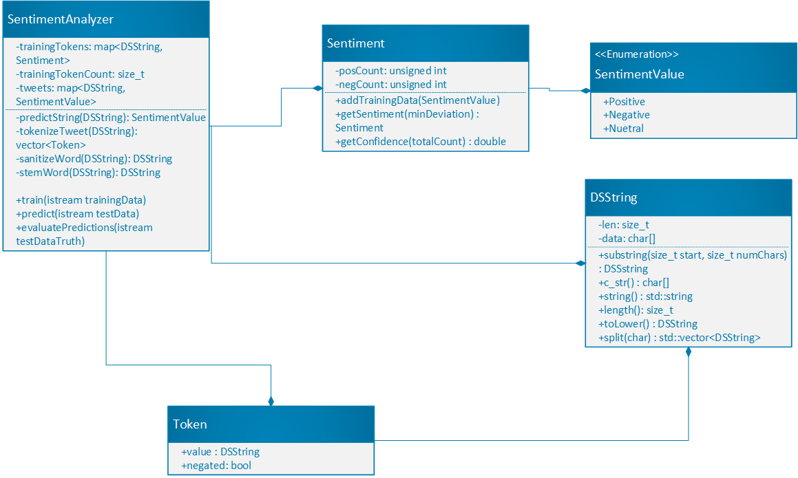

# Assignment 2: Answers

**Complete this document, commit your changes to Github and submit the repository URL to Canvas.** Keep your answers short and precise.

Your Name:

Used free extension: [ ] 24 hrs or [ ] 48 hrs

[x] Early submission (48 hrs)

[x] Bonus work. Describe: 73.300% accuracy 

Place [x] for what applies.

## UML Diagram

Add your UML class diagram here.

Replace the following image with your diagram. You can draw it by hand and take a photo.

## Answers

1. How do you train the model and how do you classify a new tweet? Give a short description of the main steps.

    > Training the model involves reading in a set of tweet and running each through a tokenizer method, I then store each of these tokens with the sentiment from the training data. Classifying a tweet involves running the tweet text through the same tokenizer method but then trying to find each of those tokens in the set of training tokens. 

2. How long did your code take for training and what is the time complexity of your training implementation (Big-Oh notation)? Remember that training includes reading the tweets, breaking it into words, counting, ... Explain why you get this complexity (e.g., what does `N` stand for and how do your data structures/algorithms affect the complexity).

   > The training algorithm is `O(N*log(N))` where `N` is the total number of words across all the tweets in the training dataset. The `N` comes from the fact that all of the words are looped through at least once (in reality 3 times), multiplied by `log(N)` because at least one of those loops includes doing a `find` operation on the map of words. 

3. How long did your code take for classification and what is the time complexity of your classification implementation (Big-Oh notation)? Explain why.

   > The classification algorithm is `O(N*log(N))` where `N` is the total number of words across all the tweets in the test dataset. The `N` comes from the fact that all of the words are looped through at least once (in reality this is anywhere from around 5 times to 55 times, but this is constant), multiplied by `log(N)` because at least one of the loops includes doing a `find` operation on the map of words. 

4. How do you know that you use proper memory management? I.e., how do you know that you do not have
   a memory leak?

   > Testing with Valgrind shows that all heap blocks were freed. See `valgrind-out.txt`

5. What was the most challenging part of the assignment?

   > I think the most challenging part was just trying all the different ideas and balancing complexity with accuracy. (ie. At one point I attempted to expand all contractions, while this gave a minor boost in accuracy, ultimately I decided to remove it because it added a lot of complexity)